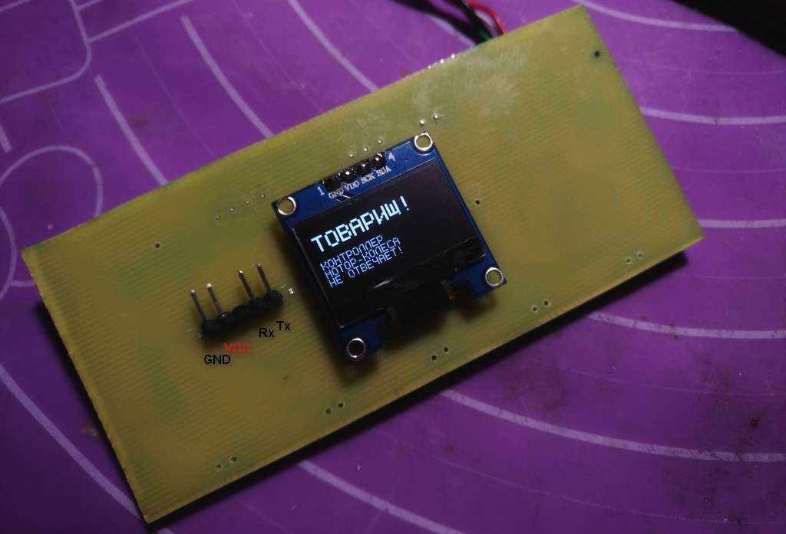
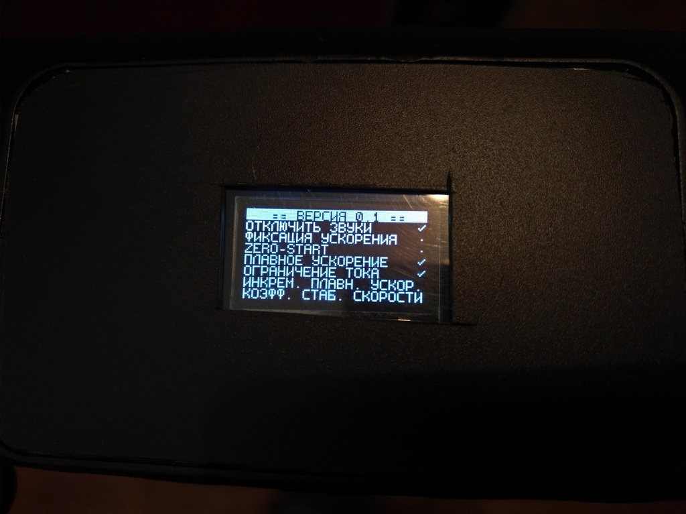
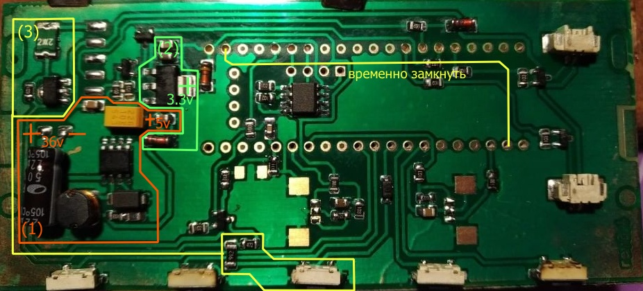
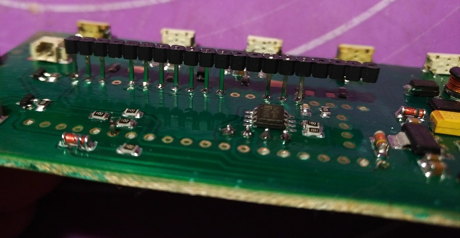
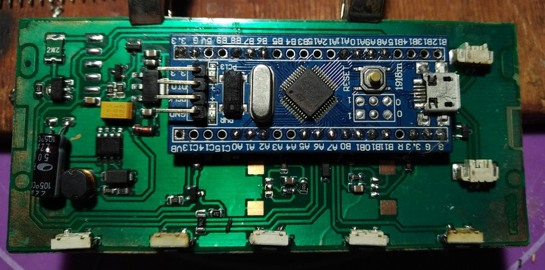

# ПРЕДУПРЕЖДЕНИЕ

Это любительское устройство, созданное автором для личного электросамоката. В
случае ВНЕЗАПНОГО отказа устройства во время пути или другого странного поведения,
автор не несёт никакой ответственности за причиненный ущерб.

Вы делаете всё на свой страх и риск.

Ко всему прочему, проект не находится в стадии завершённого.


# Описание

[📖 Руководство пользователя](docs/reference.ru.md) [(pdf)](docs/reference.ru.pdf)

## Особенности

> В связи с тем, что штатная функция круиз-контроля таковым не является, далее
> буду называть эту функцию автоматической фиксации ускорения.
> Иначе не знаю как это назвать.

* Подавление неотключаемой автоматической фиксации ускорения. Осуществляется за счёт
  подачи нулевого ускорения, затем плавного возврата в режим.
* Поддержание заданной скорости (П-регулятор, почти).
* Настоящий круиз-контроль (с поддержанием скорости, а не ускорения) с
  включением по кнопке. Это значит что устройство будет поддерживать заданную
  скорость независимо от уклона дороги.
* Переключение максимальной скорости в км/ч.
* Отображение ошибок: неподключенная ручка тормоза, неподключенная ручка акселератора,
  перегрузка по току, проблема с двигателем, нет ответа от контроллера мотор-колеса.
* Программное ограничение тока.
* Плавный старт.
* История поездок (последние 8).

* Экранная заставка для предотвращения выгорания пикселей.
* Защита от зависаний при помощи сторожевого таймера.
* Внешняя EEPROM память. Настройки не сбрасываются при перепрошивке.
* UTF-8 для исходников и шрифта. Даже Emoji можно выводить. Зачем? Да захотелось.
* Односторонняя печатная плата.


## Прочее

* Штатная функция выбора "скорости" в контроллере мотор-колеса не используется и
  установлена на уровне 3, так как после замеров оказалось, что это просто
  ограничение хода ручки акселератора.
* В устройстве используется ШИМ на выходе для пищалки. То, что пищалка уже с генератором,
  я понял слишком поздно. Но, в принципе, работает. Пищалку рекомендуется заменить на
  пьезоизлучатель с примерно такой обвязкой:

  ```
         R1
  >----[    ]----
        220R    |
              -----
        L1   |3   C| BZ1
       150mH |3   |
       (154)  -----
                |
  >--------------

  ```

* ⚠ Есть нерешённая проблема с резким ускорением на долю секунды во время пути.
  Я не знаю, проблема в помехах во время передачи или же в моём контроллере мотор-колеса.

* При отсутствии конденсаторов параллельно высоковольтной линии, возникают
  помехи, которые искажают пакет данных и самокат может ВНЕЗАПНО затормозить
  или разогнаться.

* По каким-то причинам контроллер мотор-колеса может вернуть время оборота колеса
  около 5мс, что равняется скорости примерно 400 км/ч.
  Поэтому слишком низкие значения игнорируются.

* При слишком частом подаче пакетов на контроллер мотор-колеса,
  последний начинает игнорировать некоторые из них.

## TODO

* ⚠ Довести до ума механизм подавления штатного круиз-контроля.
* ⚠ Разобраться с редким зависанием c последующей перезагрузкой.
  Кажется, это связано с дисплеем. Серьёзно?
* Реализовать "расстояние с последней зарядки". То, что самокат
  был на зарядке, определять по разнице напряжения между включениями.
* Редактирование конфигурации по USART/Bluetooth.
* Последовательности звуков.
* Моргание фары, шаблоны мигания.
* Как-нибудь применить стоп-сигнал.
* Немного зарефакторить код, не всё находится в логичных местах.
* Провести тесты на другом контроллере мотор-колеса. Возможно,
  мой контроллер - источник проблем.
* Изменение шаблонов значений ограничения скорости.
* Поддержка трёхпозиционного переключателя скоростей.


## Фото






# Сборка прошивки

## Сборка через Docker

Самый простой способ. Необходим [Docker](https://docker.com).
Параметры сборки можно изменить в Dockerfile.

```sh
docker build -t kugoo-s3-bluepill .
```

```sh
docker run -it --rm -v путь/куда/сохранить/результат:/dist kugoo-s3-bluepill
```

## Сборка вручную


Для сборки необходимы:

* Python3
* [GNU Arm Embedded Toolchain](https://developer.arm.com/tools-and-software/open-source-software/developer-tools/gnu-toolchain/gnu-rm/downloads)
* [CMake](https://cmake.org/download/)
* make
* [libopencm3 0d72e67](https://github.com/libopencm3/libopencm3/tree/0d72e6739c5f7c90f28350a8bb228722ff094806)


Дополнительные зависимости:

* openocd (прошивка и отладка)

Если вы используете Windows, то все эти пакеты можно поставить через [msys2](https://www.msys2.org/).

Сборка на примере msys2:

В корне msys2 запускаем `mingw32.exe`

Установка необходимых пакетов

```bash
pacman -S mingw-w64-i686-arm-none-eabi-gcc mingw-w64-i686-arm-none-eabi-gdb \
          mingw-w64-i686-cmake mingw-w64-i686-make mingw-w64-i686-openocd
```

Собираем libopencm3.

```shell
cd libopencm3
mingw32-make TARGETS=stm32/f1
```

Конфигурируем проект. Переходим в его корневой каталог, затем выполняем

```
mkdir build
cd build
cmake -G "MinGW Makefiles" ..
```

Файл extra/arm-gcc-toolchain.cmake при этом можно скопировать
в любое расположение и настроить под себя
(использовать абсолютные пути, например):

```
cmake -G "MinGW Makefiles" -DUSE_DEFAULT_TOOLCHAIN=OFF -DCMAKE_TOOLCHAIN_FILE=/path/to/custom/arm-gcc-toolchain.cmake ..
```


Собираем

```
cmake --build .
```

или

```
mingw32-make
```

# Точки интереса в файлах проекта

* `globals.h` - различные константы
* `settings_view.c` - объявление пунктов меню настроек
* `gui.c` - объявление экранов (например, главный экран, экран настроек,
  экран калибровки ручек)
* `views/*` - обработчики экранов

# Порядок сборки устройства

[Печатная плата, схема, список компонентов](pcb)







1. Монтаж XL7005 и обвязки. Проверка напряжений.
2. Монтаж линейного стабилизатора. Проверка напряжений.
3. Монтаж цепи включения питания и временной перемычки для проверки.
   При нажатой кнопке должны появится напряжения на стабилизаторах.
4. Монтаж остальных мелких компонентов.
5. Монтаж гребёнки для дисплея.
6. Монтаж штырьков для bluepill (**не** на плате bluepill).
   Для удобства штырьки можно припаивать в пластиковой оправе, потом
   её снять (см. выше).
7. Установка bluepill.
8. Установка дисплея.

